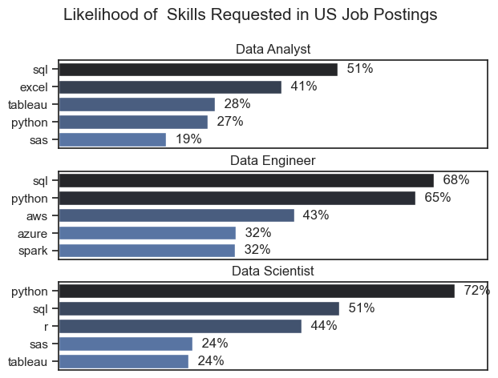
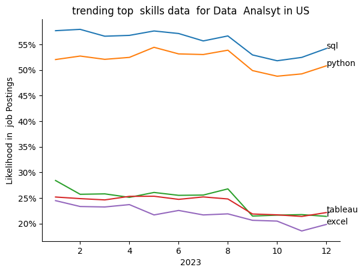
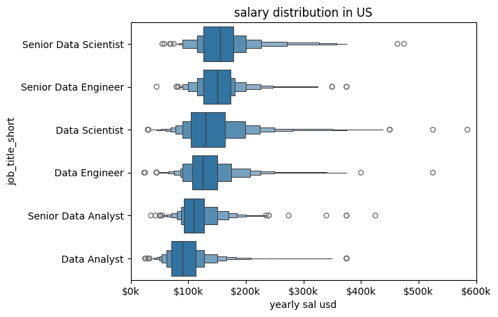
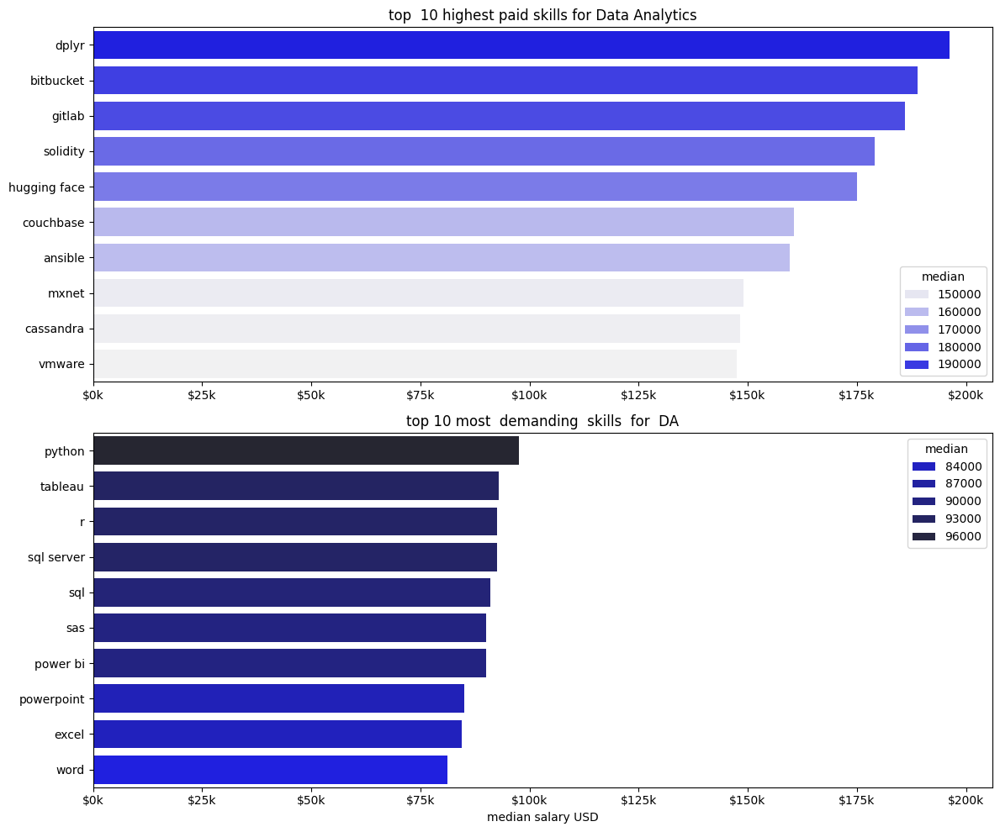
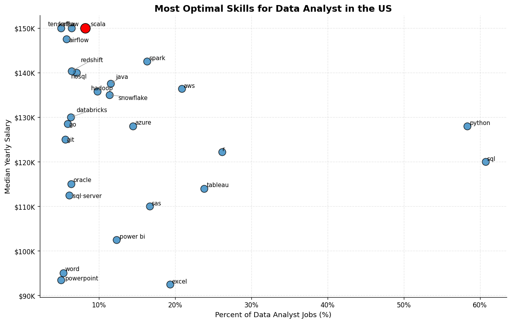

# Overview

Welcome to my analysis of the data job market, focusing on data analyst roles. This project was created out of a desire to navigate and understand the job market more effectively. It delves into the top-paying and in-demand skills to help find optimal job opportunities for data analysts.

This is a foundation for my analysis, containing detailed information on job titles, salaries, locations, and essential skills. Through a series of Python scripts, I explore key questions such as the most demanded skills, salary trends, and the intersection of demand and salary in data analytics.

# The Questions

Below are the questions I want to answer in my project:

1. What are the skills most in demand for the top 3 most popular data roles?
2. How are in-demand skills trending for Data Analysts?
3. How well do jobs and skills pay for Data Analysts?
4. What are the optimal skills for data analysts to learn? (High Demand AND High Paying) 

# Tools I Used

For my deep dive into the data analyst job market, I harnessed the power of several key tools:

- **Python:** The backbone of my analysis, allowing me to analyze the data and find critical insights.I also used the following Python libraries:
    - **Pandas Library:** This was used to analyze the data. 
    - **Matplotlib Library:** I visualized the data.
    - **Seaborn Library:** Helped me create more advanced visuals. 
- **Jupyter Notebooks:** The tool I used to run my Python scripts which let me easily include my notes and analysis.
- **Visual Studio Code:** My go-to for executing my Python scripts.
- **Git & GitHub:** Essential for version control and sharing my Python code and analysis, ensuring collaboration and project tracking.

# Data Preparation and Cleanup

This section outlines the steps taken to prepare the data for analysis, ensuring accuracy and usability.

## Import & Clean Up Data

I start by importing necessary libraries and loading the dataset, followed by initial data cleaning tasks to ensure data quality.

```python
# Importing Libraries
import ast
import pandas as pd
import seaborn as sns
from datasets import load_dataset
import matplotlib.pyplot as plt  

# Loading Data
dataset = load_dataset('lukebarousse/data_jobs')
df = dataset['train'].to_pandas()

# Data Cleanup
df['job_posted_date'] = pd.to_datetime(df['job_posted_date'])
df['job_skills'] = df['job_skills'].apply(lambda x: ast.literal_eval(x) if pd.notna(x) else x)
```

## Filter US Jobs

To focus my analysis on the U.S. job market, I apply filters to the dataset, narrowing down to roles based in the United States.

```python
df_US = df[df['job_country'] == 'United States']

```

# The Analysis

Each Jupyter notebook for this project aimed at investigating specific aspects of the data job market. Here’s how I approached each question:


# The Analysis
## 1. What are the  most demanded  skills for the top 3 most popular data roles?

To find the most demanded skills  for top 3  most  popular  data  roles . I filtered out  those positions by  which ones were  the  most popular , and  got the top 5 skills for  these top 3 roles. This query highlights the most popular job titles and their top  skills ,  showing which skill  I  should pay attention to  depending on the role I'm targetting.
View my notebook with detailed steps here:
[2_skills_count.ipynb)](C:\Users\alpha\OneDrive\Desktop\Data Analyst\__pycache__\LukeYT_DA\project_DA_Luke\2_skills_count.ipynb)

### Visualize  Data

''' python 
df_plot = df_DA_US['job_location'].value_counts().head(10).to_frame()
sns.set_theme(style='ticks')
sns.barplot(data=df_plot,x='count',y='job_location',hue='count',palette= 'dark:b_r')
sns.despine
plt.title('Counts of  Job Location for  Data Analyst in  US')
plt.xlabel('Number of  Jobs')
plt.ylabel('')
plt.show()
'''

### Results


### Insights
- Pyhton is a  versatile skill, highly demanded across all three roles, but the  most  prominently for Data Scientists (72%) and  Data Engineers (65%) .
- SQL is  the  most requested skill for  Data Analyst and  Data Scientists, with it over  half  the job postings for both  roles . For  Data Engineers,  Pyhton is   the  most  sought-after skill, appearing in  68% of  the job postings.
- Data  Engineers require more specialized technical skills(AWS,Azure,Spark) compared tp  Data Analyst and  Data Scientist  who are expected  to  be proficient in more general data management and  analysis tools (Excel,Tableau) .


# The Analysis
## 2.How are in - demand skills trending for Data Analyst

```python
from matplotlib.ticker importPercentFormatter
df_plot = df_DA_US_percent.iloc[:, :5]
sns.lineplot(data=df_plot, dashes=False,legend='full', legend='tab10')
plt.gca().yaxis.set_major_formatter
(PercentFormatter(decimals-0))
plt.show()
```

### Results
 [Trending top skills for  Data Analyst in the  US]
( )

*Bar  graph  visualizating  the  trending top skills for data analyst in the US in 2023.* 

### Key Insights – Trending Skills for Data Analysts (US, 2023)

- SQL is the most demanded skill throughout the year, consistently appearing in over 52–58% of job postings.

- Python is the second most requested skill, maintaining strong demand around 49–54%.

- Both SQL and Python show a slight dip around September–October, but demand remains high overall.

- Excel and Tableau remain important supporting skills, each appearing in roughly 20–27% of postings.

- Excel demand shows minor fluctuation but remains relatively stable across months.

- Tableau demand slightly declines toward the end of the year but stays consistently relevant.

- There is no major seasonal spike, indicating steady demand for core data skills across all months.


# The Analysis
## 3. How  well  do  jobs and  skills pay for  Data Analyst

### Salary  Analysis  for  Data  Nerds

### Visualize  Data 
``` python
sns.boxenplot(data=df_US_top6,x='salary_year_avg',y='job_title_short',order=job_order)
plt.title('salary distribution in US')
plt.xlabel('yearly sal usd')
plt.xlim(0,600000)
ticks_x=plt.FuncFormatter(lambda y,pos:f'${int(y/1000)}k')
plt.gca().xaxis.set_major_formatter(ticks_x)
plt.show()
```

### Results

*Box plot visualizing the  salary distribution for  the top  6 data job titles.*

### Insights
- Senior roles earn significantly more than non-senior roles.

- Data Scientists and Data Engineers have higher median salaries than Data Analysts.

- Data Analyst roles have the lowest salary range.

- Salaries are right-skewed, with a few very high outliers across roles.


# The Analysis
## 3. How well  do jobs and skills pay for Data 

### Highest Paid & Most  Demanded Skills for Data 

### Visualize Data

```python
fig, ax =plt.subplots(2,1, figsize=(12,10))

#seaborn -

sns.barplot(data=df_DA_top_pay,x='median',y=df_DA_top_pay.index,ax=ax[0],hue='median',palette='light:b')
#df_DA_top_pay[::-1].plot(kind='barh', y='median', ax=ax[0])#revrse  plot
ax[0].set_title('top  10 highest paid skills for Data Analytics')
ax[0].set_ylabel('')
ax[0].set_xlabel('')
ax[0].xaxis.set_major_formatter(plt.FuncFormatter(lambda x, _:f'${int(x/1000)}k'))

#seaborn-

sns.barplot(data=df_DA_skills,x='median',y=df_DA_skills.index,ax=ax[1],hue='median',palette='dark:b_r')

#df_DA_skills[::-1].plot(kind='barh', y='median', ax=ax[1])
ax[1].set_title('top 10 most  demanding  skills  for  DA')
ax[1].set_ylabel('')
ax[1].set_xlabel('')
ax[1].set_xlabel('median salary USD')


# now  here   values  were  different  to  compare  so  we  make  x limit  same  for  both
ax[1].set_xlim(ax[0].get_xlim())
ax[1].xaxis.set_major_formatter(plt.FuncFormatter(lambda x, _:f'${int(x/1000)}k'))

plt.tight_layout()

```


### Insights 
📊 Skills & Salary Insights – Data Analytics
💰 Highest Paying Skills

- Specialized tools like Dplyr, Bitbucket, GitLab, and Solidity command the highest median salaries (~$170k–$200k).

- Advanced technologies (e.g., Hugging Face, Couchbase, Cassandra) are associated with significantly higher pay.

- These high-paying skills are more niche and less commonly required in typical Data Analyst roles.

📈 Most Demanded Skills

- Python is the most in-demand skill for Data Analysts.

- SQL, Tableau, R, and SQL Server remain core technical requirements.

- Business tools like Excel and PowerPoint are widely requested but offer lower median salaries.

- High-demand skills tend to have moderate salary ranges (~$85k–$100k).


# The  Analysis
## 4. What is the  most optimal skill to learn for  Data Analyst

### Visualize Data

``` python
from adjustText import adjust_text
import matplotlib.pyplot as plt

plt.scatter(df_DA_skills_high_demand['skill_percent'],df_DA_skills_high_demand['median_salary'])
plt.show()
```
### Results


### Insights
- Python and SQL are the most in-demand skills (≈60% of postings) and offer strong salaries ($120K–$130K), making them core foundational skills.

- Scala is the highest-paying skill (~$150K) but appears in a much smaller percentage of job postings, indicating it is niche but premium.

- Big data and cloud skills like Spark, AWS, Azure, Snowflake, and Hadoop offer higher salaries ($130K–$145K) but moderate demand.

- Business tools such as Excel, Power BI, Word, and PowerPoint have high demand but lower salary ranges ($90K–$105K).

- There is a clear trade-off:

-  High-demand skills (Python,  SQL) = stable career base

- Specialized big data / cloud skills = higher salary potential


# What I Learned

Throughout this project, I deepened my understanding of the data analyst job market and enhanced my technical skills in Python, especially in data manipulation and visualization. Here are a few specific things I learned:

- **Advanced Python Usage**: Utilizing libraries such as Pandas for data manipulation, Seaborn and Matplotlib for data visualization, and other libraries helped me perform complex data analysis tasks more efficiently.
- **Data Cleaning Importance**: I learned that thorough data cleaning and preparation are crucial before any analysis can be conducted, ensuring the accuracy of insights derived from the data.
- **Strategic Skill Analysis**: The project emphasized the importance of aligning one's skills with market demand. Understanding the relationship between skill demand, salary, and job availability allows for more strategic career planning in the tech industry.


# Insights

This project provided several general insights into the data job market for analysts:

- **Skill Demand and Salary Correlation**: There is a clear correlation between the demand for specific skills and the salaries these skills command. Advanced and specialized skills like Python and Oracle often lead to higher salaries.
- **Market Trends**: There are changing trends in skill demand, highlighting the dynamic nature of the data job market. Keeping up with these trends is essential for career growth in data analytics.
- **Economic Value of Skills**: Understanding which skills are both in-demand and well-compensated can guide data analysts in prioritizing learning to maximize their economic returns.


# Challenges I Faced

This project was not without its challenges, but it provided good learning opportunities:

- **Data Inconsistencies**: Handling missing or inconsistent data entries requires careful consideration and thorough data-cleaning techniques to ensure the integrity of the analysis.
- **Complex Data Visualization**: Designing effective visual representations of complex datasets was challenging but critical for conveying insights clearly and compellingly.
- **Balancing Breadth and Depth**: Deciding how deeply to dive into each analysis while maintaining a broad overview of the data landscape required constant balancing to ensure comprehensive coverage without getting lost in details.


# Conclusion

This exploration into the data analyst job market has been incredibly informative, highlighting the critical skills and trends that shape this evolving field. The insights I got enhance my understanding and provide actionable guidance for anyone looking to advance their career in data analytics. As the market continues to change, ongoing analysis will be essential to stay ahead in data analytics. This project is a good foundation for future explorations and underscores the importance of continuous learning and adaptation in the data field.
